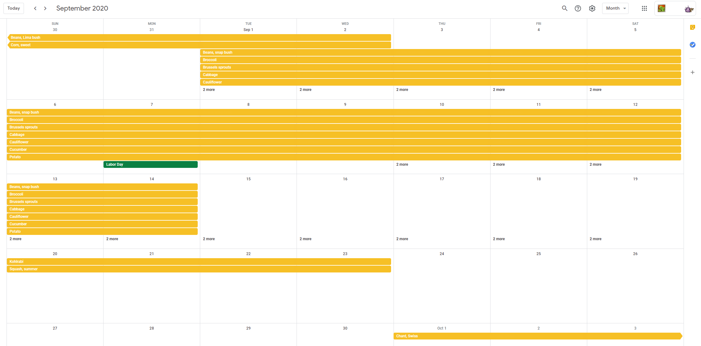

# ag2gcal

Parse [Aggie Horticulture (R)](https://aggie-horticulture.tamu.edu/) Texas planting calendars and create events in Google Calendars so it's easier to know when to plant.

## Calendars

The Google Calendars are public - feel free to share!

- [Region III] - https://calendar.google.com/calendar/u/0?cid=Y180a2lrYWg1a2ZhdTA3Yzd2OXQ1ZmllZW50MEBncm91cC5jYWxlbmRhci5nb29nbGUuY29t

## Contributing

### Prereqs

- [Jupyter Lab](https://jupyter.org/)
- `pipenv` if you want to use the [`Pipfile`](./Pipfile) to install dependencies

### Running

- Run `jupyter lab` and open the notebook!
- Follow the more detailed instructions in the notebook! :)

## Disclaimers

- I am not an Aggie.
- Aggie Horticulture (R) is not my registered trademark.
- Thank you to the Aggie Horticulture team for providing these super helpful calendars. All credit to them for crafting these.
